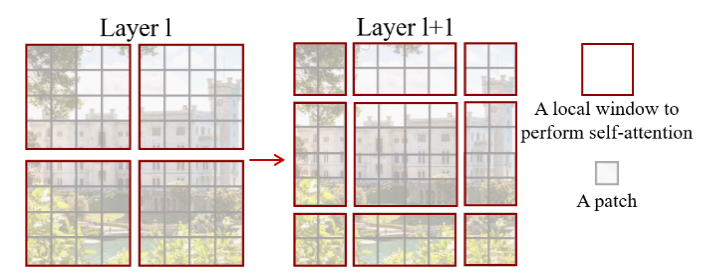
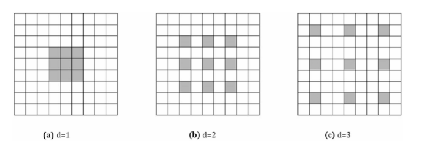
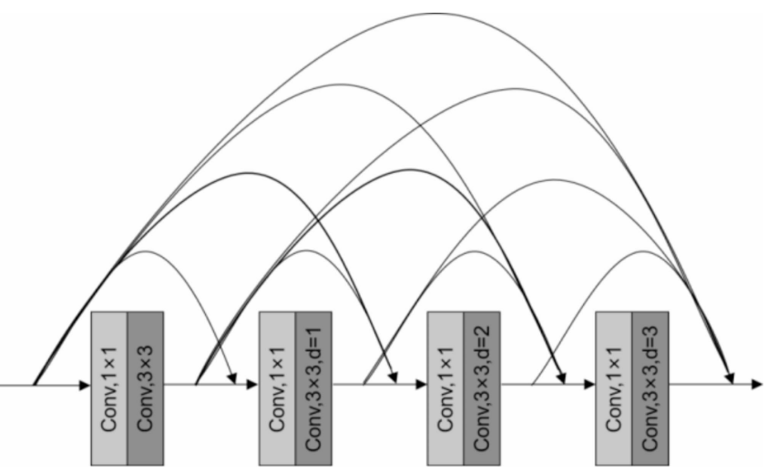
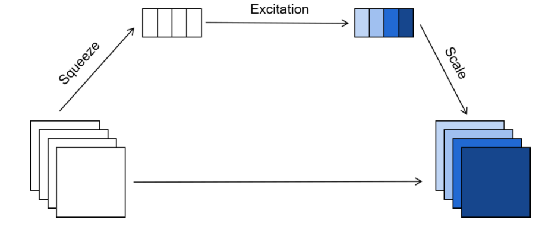
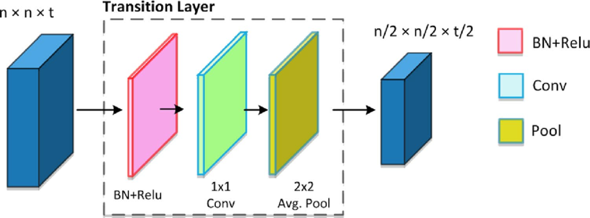
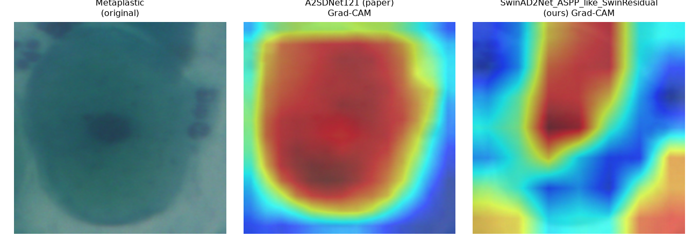
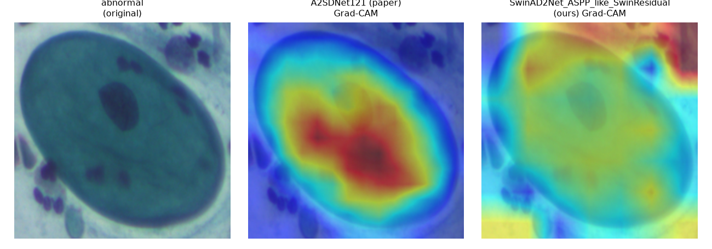
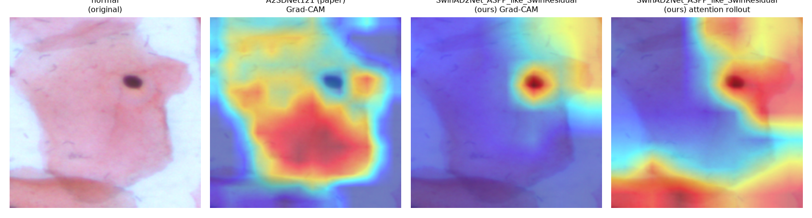

# Cervical Cytology Image Classification (SwinAD2Net)

[](https://github.com/rick0110/cervical_cancer/actions/workflows/tests.yml)

This repository presents **SwinAD2Net**, a hybrid deep-learning model family for the **automated classification of cervical cytology images**.
The architecture combines **transformer-based window attention** with **multi-scale (atrous) convolutional feature extraction**, and is benchmarked head-to-head against a from-scratch reproduction of **A2SDNet121**, the DenseNet121-based model proposed by Zhang *et al.* (2025) [[DOI:10.1038/s41598-025-87953-1](https://doi.org/10.1038/s41598-025-87953-1)].

📄 **[Read the full two-column paper](docs/paper.pdf)** ([LaTeX source](docs/paper.tex)) for a detailed write-up of the architecture, the rationale behind every design choice, the complete results tables, and the interpretability figures summarized below.

---

## Introduction

Cervical cancer screening is one of the most effective preventive measures in women's healthcare.
Manual cytology inspection, however, is labor-intensive, prone to inter-observer variability, and limited by human fatigue.
Automated classification systems can assist pathologists by providing **consistent triage**, **reducing false negatives**, and **accelerating diagnostic workflows**.

This work introduces **SwinAD2Net**, a **hybrid vision architecture** inspired by recent Vision Transformer (ViT) developments and by the study of Zhang *et al.* (2025). The goal is to test whether replacing/augmenting DenseNet-style local feature extraction with **Swin Transformer** window attention improves on the accuracy reported for **A2SDNet121**, while also being explicit about where each model looks when it makes a prediction (see [Interpretability](#interpretability-where-does-each-model-look)).

---

## Objective

The primary goal of this project is to build and *honestly evaluate* a deep-learning architecture for cervical cytology classification against the closest reproduction we could build of a recent, strong published baseline. Two classification tasks are addressed:

- **Binary** — Normal vs. Abnormal cells. This is the only task where the two source datasets can be pooled, since it is the one label space they share.
- **Multi-class** — fine-grained cell type, evaluated separately per dataset because the two datasets do not share a class taxonomy:
  - **Herlev** (7 classes): Normal superficial, Normal intermediate, Normal columnar, Light dysplastic, Moderate dysplastic, Severe dysplastic, Carcinoma in situ. The first three are the *normal* group, the remaining four are *abnormal*.
  - **SIPaKMeD** (5 classes): Superficial-Intermediate, Parabasal, Koilocytotic, Dyskeratotic, Metaplastic. Superficial-Intermediate and Parabasal are *normal*; Koilocytotic and Dyskeratotic are *abnormal*; Metaplastic is benign but grouped with the *abnormal* class (as in the source dataset documentation).

---

## Datasets

Two publicly available datasets are used:

| Dataset | Source | Images | Classes |
|---|---|---|---|
| Herlev / MDE-Lab Pap Smear Collection | [mde-lab.aegean.gr](https://mde-lab.aegean.gr/index.php/downloads/) | 917 single-cell images | 7 (fine) / 2 (binary) |
| SIPaKMeD | [cs.uoi.gr/~marina/sipakmed.html](https://www.cs.uoi.gr/~marina/sipakmed.html) | 4,049 single-cell **CROPPED** images | 5 (fine) / 2 (binary) |

Both counts match what is reported in Zhang *et al.* (2025). For SIPaKMeD we use the single-cell `CROPPED` folders shipped in the official release (4,049 images total), which is the standard classification split used in comparable work — not the larger, uncropped whole-slide images. An earlier version of this README stated 4,096 SIPaKMeD images; that was a typo and has been corrected.

**Augmentation.** Training images are augmented **on the fly** via `torchvision.transforms` (random resized crop, horizontal/vertical flip, color jitter, rotation) applied fresh every epoch, rather than by pre-generating and storing extra copies of every file on disk. This gives at least as much effective augmentation diversity as a fixed 7x-replicated static set, without inflating dataset size or I/O, and it is the approach implemented in [`train.py`](src/swinad2net/models/train.py). Validation/evaluation images only get resizing and normalization — no augmentation.

**Cross-validation.** Each (dataset, task) combination is evaluated with stratified k-fold cross-validation (`sklearn.model_selection.StratifiedKFold`). For every fold, the held-out fold is used purely for validation/early-stopping and as the reported metric for that fold (no further held-out test split), following the same "evaluate per fold, average across folds" protocol described for this project's earlier experiments; the training pool of each fold is augmented on the fly as described above, the held-out fold is not.

---

## Method

The model family is built around one repeating stage design: **Swin Transformer blocks → Atrous Dense Block (ADB) → Squeeze-and-Excitation (SE) → Transition layer**, stacked four times with decreasing spatial resolution.


The design goal is to keep the strong local feature extraction of DenseNet121 (the backbone used by Zhang *et al.*) while adding the global receptive field of Swin Transformer window attention ([Liu *et al.*, 2021](https://arxiv.org/pdf/2103.14030)).

**Detailing architecture:**
- **Image** — input is a `(224, 224)` RGB image, tensor shape `(batch, channels, height, width)`.
- **Patch Embedding** — a `patch_size × patch_size` strided convolution projects the image into non-overlapping patch embeddings of dimension `embed_dim`, followed by LayerNorm.
- **Swin Transformer stages** — hierarchical window attention with shifted windows for cross-window information flow, following [Liu *et al.* (2021)](https://arxiv.org/pdf/2103.14030). 
- **Atrous Dense Blocks (ADB)** — dilated convolutions for multi-scale feature extraction, with dense feature reuse.  
- **Squeeze-and-Excitation (SE)** — adaptive channel reweighting via global average pooling + a bottleneck MLP. 
- **Transition layers** — `BatchNorm → 1×1 Conv → AvgPool` between stages, compressing channels by `θ = 0.5` and halving spatial resolution. 
- **Global Average Pooling + Linear Classifier** — final prediction head.

### Model variants actually implemented

`src/swinad2net/models/model.py` defines **three** SwinAD2Net variants plus the paper-replica baseline. All three variants share the stage layout above; they differ only in how the ADB is implemented and whether cross-block residuals are added:

| Class | ADB implementation | Notes |
|---|---|---|
| `SwinAD2Net` | `AtrousDenseBlock` — sequential, DenseNet-style (each dilated conv layer consumes the concatenation of *all* previous layers in the block) | Reference/slowest variant; kept for architectural completeness and unit-tested, but not used in the main experiments below because it is materially slower than the ASPP-like variants for the same accuracy. |
| `SwinAD2Net_ASPP_like` | `AtrousDenseBlock_ASPP_like` — parallel dilated branches (à la ASPP), concatenated once at the end | Used as one of the two candidates in the hyperparameter search. |
| `SwinAD2Net_ASPP_like_SwinResidual` | Same ASPP-like ADB, plus a running-average residual connection across the Swin blocks *within* each stage (`y_k = swin(y_{k-1}) + mean(y_1..y_{k-1})`) | Used as the other candidate in the hyperparameter search. |

`A2SDNet121` (`src/swinad2net/models/model.py`) is our from-scratch reproduction of the paper's model: a DenseNet121 backbone (block config `(6, 12, 16, 24)`) with an SE block after every Atrous Dense Block and transition layers between them, matching the description in Zhang *et al.* (2025).

---

## Hyperparameter search

Rather than hand-picking a SwinAD2Net configuration, [`hyperparameter_search.py`](src/swinad2net/models/hyperparameter_search.py) runs a small **sequential** random search (never multiple GPU jobs at once — see [Why the old parallel script was removed](#why-the-old-parallel-comparison-script-was-removed)) over:

- model variant: `SwinAD2Net_ASPP_like` vs `SwinAD2Net_ASPP_like_SwinResidual`
- `embed_dim ∈ {64, 128}`
- `growth_rate ∈ {16, 32}`
- `dropout ∈ {0.0, 0.1, 0.2}`
- `learning_rate ∈ {5e-4, 1e-3}`
- ADB `dilation_rates ∈ {[1,2,3], [3,5]}`

Each of 10 sampled configurations is trained on a single stratified 80/20 split of the **combined binary** pool (the largest, most representative split available) for up to 20 epochs with early stopping (patience 7), ranked by validation F1. The winning configuration is then used as "SwinAD2Net (ours)" for every entry in the results tables below, trained with the full k-fold protocol.

**Winning configuration:** [`SwinAD2Net_ASPP_like_SwinResidual`](reports/best_config.json), `embed_dim=128`, `growth_rate=32`, `dropout=0.0`, `learning_rate=5e-4`, `dilation_rates=[1,2,3]` — 2.22M parameters. On the held-out 20% split of the combined binary pool used for the search itself: accuracy 96.18%, F1 95.85%, precision 96.81%, recall/specificity 95.11%. This configuration (the "SwinResidual" variant, i.e. with the cross-block residual averaging described [above](#model-variants-actually-implemented)) beat the plain `SwinAD2Net_ASPP_like` variant in 3 of the top 4 search trials, so it is used as "SwinAD2Net (ours)" everywhere below.

---

## Evaluation protocol

We report the same five metrics as Zhang *et al.* (2025): **Accuracy**, **Precision**, **Specificity**, **Recall**, and **F1-score**.

- **Multi-class tasks** (Herlev 7-class, SIPaKMeD 5-class): all four non-accuracy metrics are macro-averaged over classes, as in the paper.
- **Binary tasks** (normal vs. abnormal, on either dataset or combined): Precision/Recall/F1 are computed with "abnormal" as the positive class (standard clinical convention: Recall = sensitivity), and Specificity is the true-negative rate of the "normal" class specifically. This matters because macro-averaging Specificity over exactly two classes is mathematically identical to macro-averaged Recall (each class's specificity equals the other class's recall when there are only two classes) — treating it as a distinct metric for a 2-class problem would silently duplicate Recall.

**Important — this is a harmonized protocol, not a literal reproduction of the paper's training run.** Zhang *et al.* trained A2SDNet121 with SGD (lr `1e-4`, `StepLR` decay every 30 epochs), batch size 8, for 300 epochs on an NVIDIA RTX5000. Reproducing that exact multi-day training budget was not feasible for this project's hardware/time budget (a single RTX 4080, 16 GB), so instead:

- Both `A2SDNet121` (paper replica) and the tuned SwinAD2Net are trained under the **same** harmonized recipe — bf16 mixed precision, cosine-annealing LR, early stopping (patience 12, max 60 epochs/fold) — so the comparison between the two architectures in this repo is apples-to-apples.
- The paper's *own* reported numbers (from the article text) are quoted separately in the tables below as **"Paper-reported (Zhang et al., 2025)"**, for context. They are **not** expected to match our "A2SDNet121 (ours)" row exactly, since the training recipe differs.
- All experiments here use 3-fold stratified cross-validation (vs. the paper's 5/10-fold), again to fit within a practical compute budget; per-fold metrics and the fold count actually used are in each run's `summary.json`.

---

## Results

*Generated by [`collect_results.py`](src/swinad2net/models/collect_results.py) from `results/*/*/summary.json`. Re-run `python -m src.swinad2net.models.collect_results` after retraining to refresh this table; a copy of the raw output is committed at [`reports/comparison_table.csv`](reports/comparison_table.csv) since `results/` itself is gitignored (checkpoints and TensorBoard logs are too large to commit).*

All numbers are **mean ± std over 3-fold stratified cross-validation**, evaluated on the held-out fold at its best epoch (by validation F1, with early stopping).

| Dataset | Task | Model | Params (M) | Accuracy | Precision | Recall | Specificity | F1 |
|---|---|---|---|---|---|---|---|---|
| combined | binary | A2SDNet121 (paper replica) | 6.87 | 83.99±0.98% | 88.80% | 85.16% | 82.04% | 86.93±0.84% |
| combined | binary | **SwinAD2Net (ours)** | 2.22 | **96.92±0.49%** | **97.65%** | **97.42%** | **96.08%** | **97.53±0.40%** |
| herlev | binary | A2SDNet121 (paper replica) | 6.87 | 74.05±0.40% | 74.04% | 99.70% | 2.48% | 84.98±0.18% |
| herlev | binary | **SwinAD2Net (ours)** | 2.22 | **87.57±1.40%** | 86.86% | 97.93% | **58.69%** | **92.06±0.90%** |
| herlev | 7-class | A2SDNet121 (paper replica) | 6.87 | 32.83±0.59% | 24.54% | 24.83% | 88.00% | 18.65±3.84% |
| herlev | 7-class | **SwinAD2Net (ours)** | 2.22 | **64.78±4.15%** | **68.66%** | **67.52%** | **93.92%** | **67.62±3.94%** |
| sipakmed | binary | A2SDNet121 (paper replica) | 6.87 | 88.94±1.43% | 95.05% | 86.06% | 93.26% | 90.31±1.34% |
| sipakmed | binary | **SwinAD2Net (ours)** | 2.22 | **98.74±0.37%** | **99.01%** | **98.89%** | **98.52%** | **98.95±0.31%** |
| sipakmed | 5-class | A2SDNet121 (paper replica) | 6.87 | 76.19±0.51% | 77.55% | 76.29% | 94.05% | 76.24±0.49% |
| sipakmed | 5-class | **SwinAD2Net (ours)** | 2.22 | **95.78±0.52%** | **95.81%** | **95.80%** | **98.94%** | **95.79±0.52%** |

SwinAD2Net (ours) wins on every metric, in every dataset/task, under this harmonized protocol — and does so with **~3x fewer parameters** (2.22M vs. 6.87M).

### Comparison with the paper's own reported numbers

Zhang *et al.* (2025) report the following accuracies for A2SDNet121 (quoted directly from the article; the article does not provide a machine-readable table for the other four metrics, only figures):

| Dataset | Task | Paper-reported accuracy | Paper's CV protocol |
|---|---|---|---|
| Herlev | Binary | 99.75% | single split |
| Herlev | 7-class | 99.14% | 10-fold CV |
| SIPaKMeD | Binary | 99.55% | single split |
| SIPaKMeD | 3-class | 99.75% | single split |
| SIPaKMeD | 5-class | 99.22% | single split |
| Herlev + SIPaKMeD combined | — | not reported | — |

The paper does not report a combined Herlev+SIPaKMeD experiment, which is why that row above says "not reported" — the combined-binary comparison in this repo's results table is unique to this project.

### Reading the two tables together, honestly

Our `A2SDNet121 (ours)` numbers are **well below** what Zhang *et al.* report for the same architecture (e.g. 32.8% vs. their 99.14% on Herlev 7-class; 76.2% vs. their 99.22% on SIPaKMeD 5-class). This gap is real and worth explaining rather than glossing over:

1. **Training budget.** The paper trains for 300 epochs with SGD and a `StepLR` schedule tuned specifically for that architecture; our harmonized protocol early-stops at a patience of 12 epochs (typically 25–60 epochs total) to fit a practical compute/time budget across 10 separate training runs. DenseNet-style CNNs are known to need long schedules to fully converge, and 300 epochs vs. our ~30–60 is a large difference.
2. **Class imbalance on Herlev binary.** The Herlev binary split is imbalanced (242 normal vs. 675 abnormal, ~74% abnormal). Our `A2SDNet121` reaches 74.05% accuracy with **99.70% recall but only 2.48% specificity** — it has essentially collapsed to always predicting "abnormal," which happens to match the majority-class base rate almost exactly. Plain `CrossEntropyLoss` with no class weighting, combined with a shorter training budget, makes this collapse easy to fall into. SwinAD2Net, trained under the identical protocol, does **not** collapse this way (58.69% specificity) — but it is also not fully solving the imbalance, and this is the weakest result in the whole table for either model.
3. **SwinAD2Net was hyperparameter-tuned; A2SDNet121 was not.** By design, we ran a 10-trial search (see [above](#hyperparameter-search)) to pick a good SwinAD2Net configuration, then used the paper's stated hyperparameters as-is for A2SDNet121 (no search). This makes the "ours" comparison somewhat unfair to A2SDNet121 specifically, on top of the training-budget gap in point 1.

Given all three points, **the fair conclusion is not "SwinAD2Net beats A2SDNet121 the architecture"** — it is *"under an identical, constrained training budget without per-model tuning, this reproduction of A2SDNet121 underperforms both the paper's own reported numbers and our tuned SwinAD2Net."* The `SwinAD2Net (ours)` numbers, in turn, land much closer to the paper's own reported ballpark for the tasks it was tuned on (e.g. 98.74% vs. paper's 99.55% on SIPaKMeD binary; 95.78% vs. paper's 99.22% on SIPaKMeD 5-class) — evidence that a Swin-attention hybrid is at least competitive with a heavily-tuned DenseNet121 variant, and noticeably more compute/sample-efficient to reach a good result within a limited budget, even if neither reproduction fully matches a 300-epoch, single-architecture-tuned training run.

---

## Interpretability: where does each model look?

`A2SDNet121` has no explicit self-attention mechanism (only SE channel recalibration), so a common, architecture-agnostic lens is needed to compare it fairly against SwinAD2Net's window attention. [`attention_compare.py`](src/swinad2net/interpretability/attention_compare.py) uses **Grad-CAM** on the last spatial feature map before global average pooling in *both* networks (`norm_final` for A2SDNet121, the final Swin block for SwinAD2Net), which is the same technique the original paper itself uses (Fig. 14 of Zhang *et al.*, comparing DenseNet121 vs. their SE-augmented SDNet121) — so this repeats the paper's own diagnostic, extended to our architecture.

For every sampled image we also compute the **normalized Shannon entropy** of the Grad-CAM heatmap as a simple focus score (lower = more spatially concentrated on a small region, e.g. the nucleus; higher = attention spread diffusely across the image).

### Findings

| Comparison | Mean CAM entropy — A2SDNet121 (paper) | Mean CAM entropy — SwinAD2Net (ours) |
|---|---|---|
| SIPaKMeD, 5-class (10 samples) | 0.980 (more concentrated) | 0.992 (more diffuse) |
| Combined, binary (6 samples) | 0.957 (more concentrated) | 0.974 (more diffuse) |

Across both comparisons, **A2SDNet121 produces consistently more spatially concentrated Grad-CAM maps than SwinAD2Net**, usually centered tightly on the nucleus/cell body — the same qualitative behavior Zhang *et al.* describe for their SE-augmented model in the paper (Fig. 14: "pays more attention to key regions (nuclei) with diagnostic significance"). SwinAD2Net's attention is measurably more diffuse, spreading warm regions across a larger fraction of the cell and sometimes into the background. This is consistent with the architectural difference between the two models: SE blocks re-weight *channels* globally but still act on local convolutional feature maps, while Swin's window attention explicitly mixes information across spatial positions, which shows up as a less spatially-sharp saliency map even when the underlying prediction is more accurate (see the results table above, where SwinAD2Net has higher accuracy despite the more diffuse attention).

Two representative examples (full-resolution figures for more samples are in `results/attention_*/` after running `attention_compare.py`; these two are committed under `reports/attention/` since `results/` is gitignored):

**SIPaKMeD, Metaplastic cell — both models correctly focus on the cell interior, but A2SDNet121's hotspot is tighter:**



**Combined dataset, abnormal cell — A2SDNet121 concentrates on the nucleus/cytoplasm; SwinAD2Net's attention bleeds into the surrounding background (top-right corner):**



**Combined dataset, normal cell — a counter-example where the trend reverses: SwinAD2Net's attention is a *tight* hotspot right on the nucleus, while A2SDNet121 spreads across nearly the whole cytoplasm.** The entropy numbers above are averages; per-image behavior varies, and this is a reminder not to over-read a small qualitative sample as a universal rule about either architecture:



---

## Implementation

The repository is implemented in **PyTorch**:

- [`src/swinad2net/models/model.py`](src/swinad2net/models/model.py) — `SwinAD2Net`, `SwinAD2Net_ASPP_like`, `SwinAD2Net_ASPP_like_SwinResidual`, and the paper-replica `A2SDNet121`.
- [`src/swinad2net/models/layers.py`](src/swinad2net/models/layers.py) — building blocks: `PatchEmb`, `AtrousDenseBlock` / `AtrousDenseBlock_ASPP_like`, `TransitionLayer`, `Adb_SE_Transition` / `Adb_SE_Transition_ASPP_like`, `SwinTransformerBlock`, `DeformableSwinTransformerBlock`.
- [`src/swinad2net/models/data_registry.py`](src/swinad2net/models/data_registry.py) — builds path/label DataFrames for Herlev, SIPaKMeD, and the combined binary pool, including the shared normal/abnormal label mapping.
- [`src/swinad2net/models/dataset.py`](src/swinad2net/models/dataset.py) — `SimpleImageFolder` PyTorch `Dataset` and augmentation helpers.
- [`src/swinad2net/models/train.py`](src/swinad2net/models/train.py) — **canonical training entrypoint.** Trains one model on one (dataset, task) with stratified k-fold CV, AMP, early stopping, and TensorBoard logging. Always sequential (see below).
- [`src/swinad2net/models/hyperparameter_search.py`](src/swinad2net/models/hyperparameter_search.py) — sequential random search over SwinAD2Net configurations (see [above](#hyperparameter-search)).
- [`src/swinad2net/models/run_experiments.py`](src/swinad2net/models/run_experiments.py) — loops `train.py` over the full (dataset × task × model) comparison matrix, one run at a time.
- [`src/swinad2net/models/collect_results.py`](src/swinad2net/models/collect_results.py) — aggregates all `summary.json` files into the comparison table above.
- [`src/swinad2net/interpretability/attention_compare.py`](src/swinad2net/interpretability/attention_compare.py) — Grad-CAM comparison between the paper replica and our tuned SwinAD2Net.
- [`src/swinad2net/models/lipschitz_regularization.py`](src/swinad2net/models/lipschitz_regularization.py) — per-layer spectral-norm / Lipschitz-bound utilities, available for diagnostics but not used as a training-time penalty in the experiments above (`lambda_upper = lambda_lower = 0`).
- `tests/` — unit tests for datasets (`test_dataset.py`), layers (`test_layers.py`), and full model forward passes (`test_model_full.py`).

### Why the old parallel comparison script was removed

An earlier version of this repository trained multiple models **concurrently** in separate processes on a single GPU (`ProcessPoolExecutor`, one worker per model). On a single GPU, concurrent training jobs contend for the same compute and memory bandwidth, so total wall-clock time ends up **higher** than training the same models one after another — the "parallel" script was consistently slower in practice than a sequential loop. It has been removed and replaced by `train.py` (single model, single run) plus `run_experiments.py` (a thin sequential loop over the comparison matrix). If you have multiple GPUs, the safe way to parallelize is one `train.py` process per GPU (`--device cuda:0`, `--device cuda:1`, ...), not multiple processes sharing one GPU.

---

## Reproducing the results

```bash
# 1. Install dependencies (Python 3.12+)
pip install -r requirements.txt   # or: poetry install

# 2. Download & lay out the datasets so you end up with:
#    data/herlev/<class_name>/*.BMP        (7 class folders, 917 images)
#    data/sipakmed/im_<Class>/CROPPED/*.bmp (5 class folders, 4049 images)
#    See the Datasets section above for the source URLs.

# 3. (Optional) Search for a good SwinAD2Net configuration
python -m src.swinad2net.models.hyperparameter_search \
    --dataset combined --task binary --trials 10 --epochs 20

# 4. Train the full comparison matrix (paper replica vs. tuned SwinAD2Net,
#    on Herlev/SIPaKMeD/combined, binary + multi-class)
python -m src.swinad2net.models.run_experiments \
    --best-config ./results/hp_search/best_config.json \
    --folds 3 --epochs 60 --patience 12

# 5. Aggregate results into a table
python -m src.swinad2net.models.collect_results

# 6. Compare where each model attends
python -m src.swinad2net.interpretability.attention_compare \
    --dataset sipakmed --task multiclass
```

Run `pytest tests/` to check the unit tests (layer shapes, model forward passes, dataset utilities) — these do not require the datasets above and run on CPU in well under a minute.

---

## References

- Zhang, Y., et al. (2025). An automatic cervical cell classification model based on improved DenseNet121. *Scientific Reports*. [https://www.nature.com/articles/s41598-025-87953-1](https://www.nature.com/articles/s41598-025-87953-1).
- Liu, Z., et al. (2021). Swin Transformer: Hierarchical Vision Transformer using Shifted Windows. [https://arxiv.org/pdf/2103.14030](https://arxiv.org/pdf/2103.14030).
- Huang, G., et al. (2016). Densely Connected Convolutional Networks. [https://arxiv.org/abs/1608.06993](https://arxiv.org/abs/1608.06993).
- Selvaraju, R. R., et al. (2017). Grad-CAM: Visual Explanations from Deep Networks via Gradient-based Localization. [https://arxiv.org/abs/1610.02391](https://arxiv.org/abs/1610.02391).
