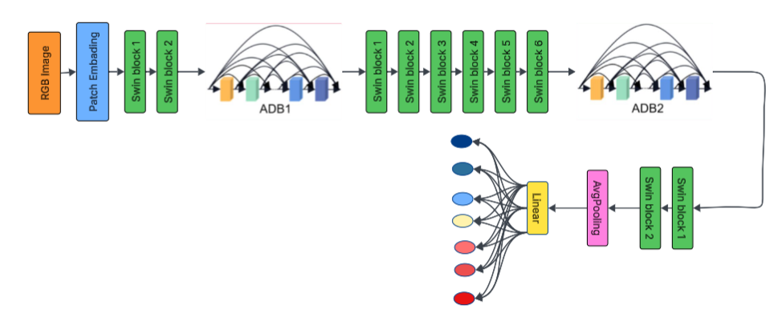

# 👋 Welcome to SwinAD2Net

This repository contains my work on **cervical cytology image classification** using a hybrid deep-learning architecture called **SwinAD2Net**.

The goal is to support earlier and more reliable screening by combining:
- **Swin Transformer** (global context modeling)
- **Atrous Dense Blocks** (multi-scale local feature extraction)
- **Squeeze-and-Excitation modules** (adaptive channel emphasis)

---

## 📌 Project Highlights

- Medical imaging focus: cervical cell classification
- Binary and multi-class learning setups
- PyTorch-based implementation
- Unit tests for dataset, layers, and full model flow
- Experiment tracking support (TensorBoard)

---

## 🧠 Why this project?

Manual cervical cytology screening is time-consuming and can vary across observers.  
This project explores how transformer + CNN hybrid models can improve consistency and performance for computer-aided diagnosis.

---

## 🗂 Repository Structure

- `src/swinad2net/models/model.py` — main model architectures
- `src/swinad2net/models/layers.py` — custom building blocks
- `src/swinad2net/models/dataset.py` — dataset and loading utilities
- `src/swinad2net/models/script_compare_paper_vs_hyperband.py` — training/experiment script
- `tests/` — unit tests
- `img/` — architecture figures used in documentation

---

## 🧪 Quick Start

### 1) Install dependencies

```bash
pip install -r requirements.txt
```

### 2) Run tests

```bash
pytest -q
```

---

## 🏗 Architecture Preview



---

## 📚 References

- Zhang, Y., et al. (2025). *An automatic cervical cell classification model based on improved DenseNet121*.  
  https://www.nature.com/articles/s41598-025-87953-1
- Liu, Z., et al. (2021). *Swin transformer: Hierarchical vision transformer using shifted windows*.  
  https://arxiv.org/pdf/2103.14030
- Huang, G., et al. (2016). *Densely connected convolutional networks*.  
  https://arxiv.org/abs/1608.06993
